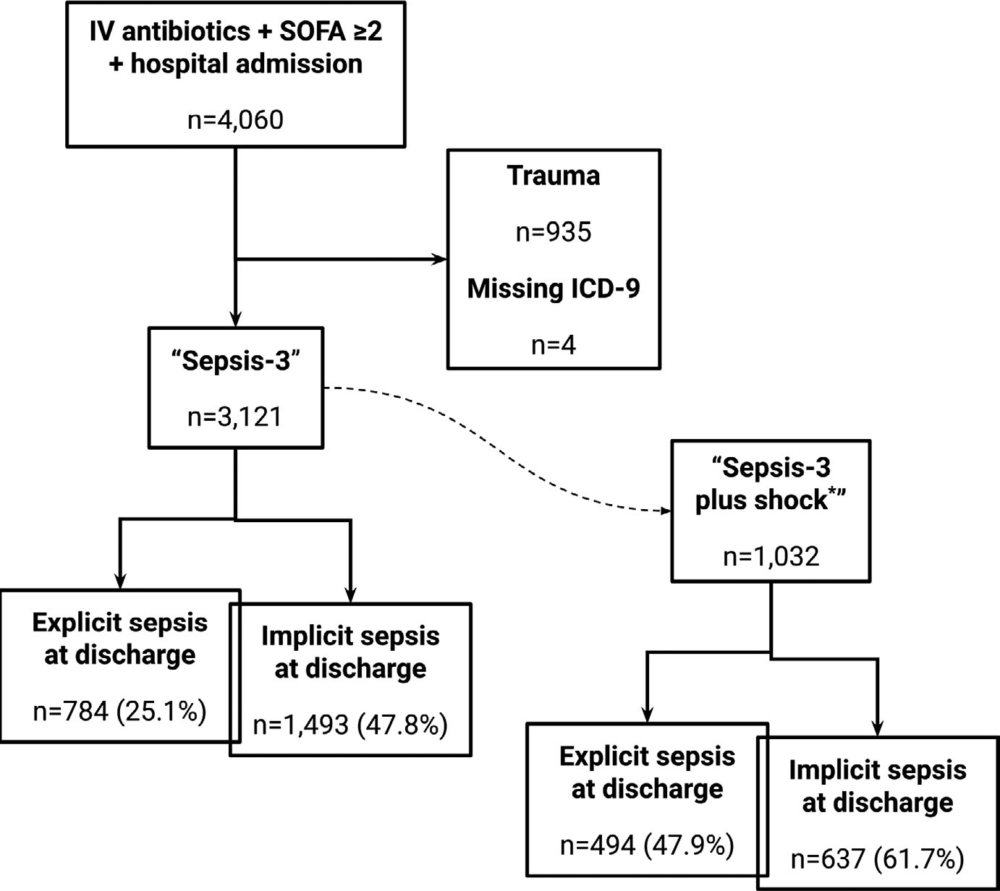

# Sepsis Definition

## Study Overview
### Purpose of the Study
- Examine sepsis diagnosis in emergency departments (EDs)
- Analyze an 8-year period of patient data
- Explore relationship between ED criteria and discharge diagnoses

### Study Design
- Retrospective observational cohort analysis
- Focus on adult patients with suspected sepsis
- Utilized Sepsis-3 definition and criteria

## Key Findings
### Diagnosis Challenges
- Significant proportion of sepsis patients undiagnosed
- Only 2% diagnosed with sepsis at discharge
- 60% to 75% meeting Sepsis-3 criteria not diagnosed

### Treatment Implications
- Over-treatment of nonseptic patients
- Potential harm from unnecessary interventions
- Compliance with quality metrics may lead to misdiagnosis

## Patient Data Analysis
### Patient Cohort
- Analyzed 4,060 patients receiving IV antibiotics
- 3,121 met Sepsis-3 criteria, 1,032 with shock criteria
- Mean age of patients was 59 years

### Mortality and Outcomes
- Mortality rates: 8.7% for Sepsis-3, 15.6% for Sepsis-3 plus shock
- Common noninfectious diagnoses among treated patients
- ICU lengths of stay affected by early patient deaths

## Risk Factors and Guidelines
### Identifying Risks
- Specific risk factors for harm include CHF and ESRD
- Uncertainty in fluid resuscitation methods for sepsis
- Need for further research on sepsis management protocols

### Clinical Guidelines
- Importance of early identification and intervention
- SEP-1 core measure linked to hospital care quality
- Variability in treatment relevance for sepsis management

## Limitations and Future Research
### Data Limitations
- Potential human and technological errors in data
- Misattribution bias from ICD-9 codes
- Nonspecific definition of suspected infection

### Future Directions
- Need for external validation of findings
- Exploration of risk factors associated with sepsis
- Development of more precise sepsis management protocols

## References
### Key Studies and Reports
- Various studies on sepsis management and outcomes
- Importance of early goal-directed therapy
- Proposed randomized trial on fluid therapy for septic shock

### Authors and Publication
- Authored by Litell JM, Guirgis F, Driver B, Jones AE
- Published in Academic Emergency Medicine, 2021

## Extracted Figures

Caption: aem podcast - episode 1 - the future of the american dream

OCR: ATLA

ANB
Podcasts

Caption: media release logo

OCR: Media
Release

Caption: a white and black striped rug with a white border

Caption: checkupdates com logo

OCR: ® Check for updates

Caption: figure 1 - the proposed method for the use of the new method for the use of the new method

OCR: IV antibiotics + SOFA 22
+ hospital admission

n=4,060
Trauma
n=935
Missing ICD-9

“Sepsis-3”
n=3,121

“Sepsis-3
plus shock”

n=1,032

Explicit sepsis

at discharge Implicit sepsis

at discharge

n=784 (25.1%) |] 1-7 493 (47.8%)

Explicit sepsis

at discharge Implicit sepsis

at discharge

n=494 (47.9%)

n=637 (61.7%)

